# crab-cam

A Claude Code mod: a small crab above the prompt acts out what Claude is doing, in the terminal and in the desktop app. Beside it, a shell shows how full the context window is and how much of your rate limits is used.

> Optimised for the Claude Code desktop app.



## Install

```bash
claude plugin marketplace add sTomerG/agent-kit
claude plugin install crab-cam@agent-kit
```

Requires Claude Code v2.1.287 or later; tested with v2.1.288.

To get new versions, run `claude plugin update crab-cam@agent-kit`, or enable auto-update for the marketplace under `/plugin` → Marketplaces.

## Commands

| Command | What it does |
| :- | :- |
| `/crab-cam` | Hide or show the crab |
| `/crab-cam demo` | Play every scene, three seconds each |
| `/crab-cam meter` | Hide or show the shell meter |
| `/crab-cam details` | Show or hide the meter's readings in figures beside the shell |
| `/crab-cam commands` | Show commands as typed, or go back to the description of what they do |

## Scenes

The scene follows the tool Claude calls. A shell command is read for what it does, so `cat` shows reading and `cd repo && git status` shows git.

| Scene | Shown when |
| :- | :- |
| thinking, writing a reply | Claude reasons or writes text |
| reading | `Read`, or `cat`, `head`, `tail`, `sed -n`, `jq` in a shell |
| writing code | `Edit`, `Write`, or `sed -i`, `cat > file` in a shell |
| searching | `Grep`, `Glob`, or `grep`, `rg`, `find`, `ls` in a shell |
| browsing the web | `WebFetch`, `WebSearch`, browser tools, `curl`, `wget` |
| running a command | any other shell command |
| running tests | `pytest`, `vitest`, `jest`, `npm test`, `cargo test` and the like |
| working with git | `git` and `gh`, also further on in a chain such as `make build && git status` |
| installing packages | `npm install`, `pip install`, `uv add`, `brew install` and the like |
| putting helpers to work | subagents and workflows, also while they run on in the background after the turn |
| making a plan | plan mode and task lists |
| loading a skill | `Skill` |
| writing text | an edit to a text file: `.md`, `.txt`, `.rst`, `README`, `CHANGELOG` and the like |
| designing | an edit to a stylesheet or an `.svg`, a design or Figma tool, a design or diagramming skill, the start of an artifact, and an edit to an `.html` page later in that same turn |
| remembering something | an edit to `CLAUDE.md`, `MEMORY.md` or a memory file |
| sharing something | artifacts and files sent to you |
| a question for you, waiting for permission | Claude asks, or a permission dialog is open |
| waiting on a background task | Claude polls a background command or timer, or the turn ended with a command still running |
| using a tool | any other tool |
| tidying up its memory | the conversation is compacted |
| oops | a tool call failed, or an API error or refusal ended the turn |
| done, resting | the turn ended |

Work inside a subagent is not shown; the crab stays on "putting helpers to work" until the helper returns.

## Meter

The shell fills as things are used:

- **Ribs**: the context window.
- **Five pearls**: the 5-hour rate limit.
- **Seven smaller pearls**: the weekly rate limit.

The last two units of a gauge turn red above 85%. The pearls are left out on accounts without rate-limit windows.

The meter comes in two forms, and `/crab-cam meter` hides it altogether:

| Default | With details (`/crab-cam details`) |
| :- | :- |
|  |  |

## Development

```bash
claude --plugin-dir ./plugins/crab-cam   # load from disk, reload on save
claude plugin test plugins/crab-cam      # run the tests
claude plugin validate plugins/crab-cam  # check the manifest and hooks
npx tsx plugins/crab-cam/scripts/make-demo.mts  # redraw the animations in assets/
```

The editor types under `.claude-plugin/types/` are generated and not committed. Claude Code writes them for your version when it loads the mod with `--plugin-dir`.

---

An unofficial community project, not affiliated with or endorsed by Anthropic.
